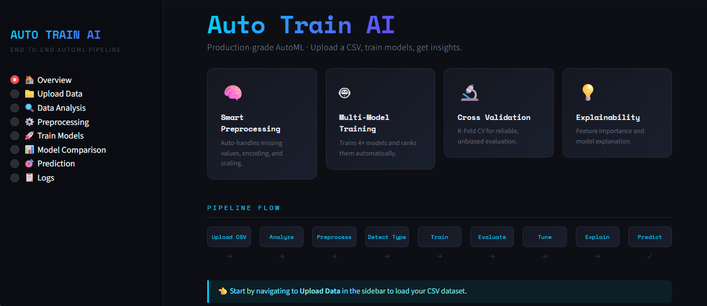
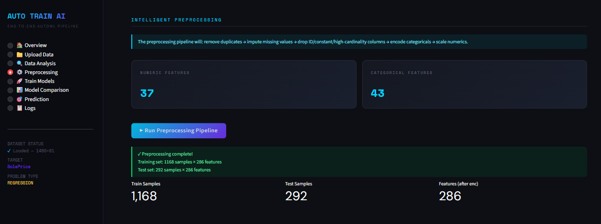
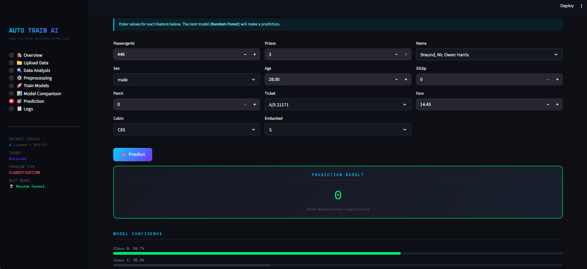

# Auto Train AI

## Overview

Auto Train AI is an end-to-end machine learning web application that automates the machine learning workflow. The system performs automatic data preprocessing, trains multiple machine learning models, evaluates their performance, and selects the best-performing model based on accuracy.

The application is developed using Python, Scikit-learn, and Streamlit to provide a simple and user-friendly interface for training and testing machine learning models.

---

## Features

- Automatic data preprocessing
- Handling missing values
- Label encoding and feature transformation
- Automatic problem type detection
- Training multiple machine learning models
- Hyperparameter tuning
- Best model selection based on accuracy
- Model performance comparison
- Prediction system using trained model
- Interactive Streamlit user interface

---

## Technologies Used

- Python
- Pandas
- NumPy
- Scikit-learn
- Streamlit
- Matplotlib
- Joblib

---

## Machine Learning Models Used

- Logistic Regression
- Decision Tree Classifier
- Random Forest Classifier
- K-Nearest Neighbors (KNN)

---

## Project Workflow

1. Upload dataset
2. Data preprocessing
3. Feature transformation
4. Train-test split
5. Model training
6. Hyperparameter tuning
7. Model evaluation
8. Best model selection
9. Prediction generation

---

## Project Structure

```text
Auto-Train-AI/
│
├── app.py
├── requirements.txt
├── README.md
├── .gitignore
│
├── artifacts/
│   ├── bestmodel.pkl
│   └── preprocessor.pkl
│
├── data/
│
├── notebooks/
│   └── AutoTrainAI_Experiments.ipynb
│
├── screenshots/
│   ├── home.png
│   ├── preprocessing.png
│   ├── model_training.png
│   └── prediction.png
```

---

## Screenshots

### Home Page



### Data Preprocessing



### Model Training


### Prediction System



---

## Installation

Clone the repository:

```bash
git clone git clone https://github.com/HariniSri01/Auto-Train-AI.git
```

Install required dependencies:

```bash
pip install -r requirements.txt
```

Run the Streamlit application:

```bash
streamlit run app.py
```

---

## Future Improvements

- Support for deep learning models
- Cloud deployment
- Improved UI design
- Advanced AutoML pipeline
- Real-time model monitoring

---

## Author

Harini Sri